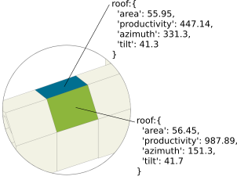

Documentation of `solar-sim`
------------------------------

# Introduction
The solar-sim tool simulates a photovoltaic or solar thermic installation for a residential building. It takes building, user and financial parameters as inputs and compute several energetic, financial and environmental indicators as outputs. There is one function for the simulation of a photovoltaic installation (`solarSim`) and another one for a solar thermic installation (`thermicSolarSim`). Both functions take the same input but result in different outputs.

# Usage
This simulator was written in Typescript (in `/src/*.ts`). You can compile the code to Javascript using `$ npm run build`. Then, you can run `$ node lib/example.js` to see the simulator in action: e.g., change the values of the inputs or constants in `example.js` and see what is changing at the outputs in the console.

# Tests
Units tests were written in `/test`. Run them using: `$ ./node_modules/mocha/bin/mocha`.

# Technical description
## Classes
The code is organised along 5 classes.

### 1) The `User` class
The user is understood here as the "person" that want to install some photovoltaic or thermic solar panels on his `Building`. It is characterised by some consumption profile.

### 2) The `Roof` class
The roof is understood as a single roof unit that is characterised by a unique tilt (inclination), azimuth (orientation) and solar productivity.

### 3) The `Building` class
A building has one user. It can have one or several Roof. The solar production is aggregated at the building level.

### 4) The `Financial` class
The `financial` class holds all the information about financial parameters.

### 5) The `Environmental` class
The `environmental` class holds all the information about environmental parameters.

### 6) The `Thermic` class
The `thermic` class mixes some user, financial and environmental parameters but only concerns the thermic solar panels, not the photovoltaic ones.

## Special functions

In this section we explain the main modelling choices and some complex computation of the solar simulator. For the other functions, we kindly refer to the code of the simulator, reasonably hoping it will be self-explanatory.

### Optimisation of the usable areas
* Function: `optimizeRoofAreas(Building, actualArea)`
* In case some area is inputed (in `inputs.pvArea`), some roofs or part of a roof must be chosen. We decided to choose the best roofs first by sorting them by decreasing solar irradiance. Note that only a fraction of some roof area may be chosen in order to have a building photovoltaic area that is strictly equal to the inputed area.

### Optimisation of the power of the photovoltaic installation
* Function: `optimizeRoofPowers(Building, potentialPower)`
* The maximal power of a domestic photovoltaic installation is limited (see `constants.max_power`). However, some well-exposed and/or large building may have a potentially higher power installation. In case the potential power is higher than this limit, the `optimizeRoofPowers` function allocate the best roofs for setting the solar panels. First, the function set the total power to zero and then gradually add the best roofs until the limit is reached. When the limit is reached, the remaining roofs receive a power of zero. This function thus allows to select the best roofs (sorted by decreasing solar irradiance) that can be used for photovoltaic production. Once a set of roofs has been chosen, the production of each roof is updated (given the new powers that have been attributed to the roofs).

### Photovoltaic autonomy
* Function: `User.computeSelfConsumptionRate()`
* The photovoltaic autonomy is taken from an empirical look-up table. The first key of the table is the ratio of the photovoltaic production by the annual electricity consumption. The second key of the table is a level of “user autonomy”. This level is determined as follows:
    1. the user adopts some energy sobriety behaviours;
    2. the user does some charge shift, i.e., it consumes more electricity during the (sunny) day than during the night;
    3. the user has a electric heater programmed as a function of the solar production;
    4. the user has some home batteries.

### Selection of the best roof in thermic
* Function: `getAzimuthBestRoof(constants, Building)`
* In the solar thermic simulator, we consider that the solar panels will be installable on one roof only, i.e., the installation won’t be split over several roofs. The roof chosen for the thermic solar panels will be the best roof in terms of solar irradiance (thus accounting for orientation, tilt and shadows) where the following conditions are met:
    1. the roof must be South-oriented (actually with azimuth between 78.75 (East-North-East) and 281.25°(West-North-West))
    2. the roof must have a usable area of minimum `constants.min_thermic_area`.

### Solar production in thermic
* Function: `thermic.computeSolarProduction()`
* As opposite of the photovoltaic production, the thermic solar production is empirically determined using a look-up table. This table gives an annual solar production (kWh/year) given the azimuth of the roof and the average hot water consumption (`thermic.literByDay`).

### Gain in thermic
* The gain (€) for the solar thermic installation is equal to the sum of the supporting grant and the cost of the saved energy used for producing hot water. The latter is computed for each year using actualised energy prices as:
`annualGain = t.solarProduction / t.producerYield * actualEnergyBuyingPrice`
where `t.producerYield` is the yield of the hot water production system (based on a external source of energy, being gas, fuel or electricity) and `actualEnergyBuyingPrice` the actualised price of this energy, depending on both a base price and a price index. The choice of the source of energy used for hot water production (`inputs.thermicHotWaterProducer`) has thus an impact on the solar thermic gain.

## Inputs, outputs and constants

### Inputs

All the input (with default values) are presented in the following table. The main input, namely, `roofs`, is the collection of the roofs of a building, each of them being characterised by its area, azimuth, productivity and tilt. Here is below is a schema of how the roofs should be modeled for representing a building.

| inputs variable              | default value | units       | description                                                                                                                                                                                                       |
|------------------------------|---------------|-------------|-------------------------------------------------------------------------------------------------------------------------------------------------------------------------------------------------------------------|
| Photovoltaic                 |               |             |                                                                                                                                                                                                                   |
| roofs                        |               |             | Collection of roof objects where the solar potential will be computed. Can be 1 or several roofs. Each roof object must be characterised by the below-mentioned properties: area, azimuth, productivity and tilt. |
| *roof.area*                    |               | m²          | Area of the roof.                                                                                                                                                                                                 |
| *roof.azimuth*                 |               | °           | Average azimuth of the roof (aka its orientation), expressed in degree with 0° = North and 180° = South.                                                                                                          |
| *roof.productivity*            |               | kWh/m².year | Average annual solar productivity of the roof, i.e., the sum of the solar irradiance received by the roof over one year. Typically around 1000 kWh/year.m2 for a well-exposed roof in Bruxelles.                  |
| *roof.tilt*                    |               | °           | Average tilt of the roof (aka its inclination, or slope) expressed in degree with 0° being a horizontal (flat) roof and 90° being a vertical roof.                                                                |
| pvTechnology                 | mono          |             | Photovoltaic technology of the solar panels. Can be mono (for monocristallin), poly (polycristallin) or mono_high (high yield monocristallin).                                                                    |
| nYears                       | 10            | year        | Number of years for computing financial benefit. The longer is it, the larger is the benefit.                                                                                                                     |
| currentYear                  | 2018          |             | Current year. Should be determined from the browser.                                                                                                                                                              |
| elecSellingPrice             | 0.03          | €/kWh       | Price for selling electricity for prosumers                                                                                                                                                                       |
| CVPrice                      | 85            | €           | Price of a certificat vert                                                                                                                                                                                        |
| pvArea                       |               | m²          | Area of the photovoltaic installation. Can be computed based on roof area or inputed.                                                                                                                             |
| annualConsumptionKWh         | 2036          | kWh         | Average annual electricity consumption of the building                                                                                                                                                            |
| installationPrice            |               | €           | Cost of the photovoltaic installation. It is inputed or computed based on the power of the installation and the photovoltaic technology.                                                                          |
| obstacleRate                 | 0.182         |             | Average obstacle rate of the roof surfaces. It is used to decrease the available area for photovoltaic installation                                                                                               |
| VATrate                      | 0.06          |             | Annual VAT rate                                                                                                                                                                                                   |
| annualMaintenanceCost        |               | €           | Annual maintenance cost of the photovoltaic installation. It is inputed or computed based on the price of the photovoltaic installation                                                                           |
| loanPeriod                   | 5             | year        | Duration of the loan                                                                                                                                                                                              |
| loanRate                     | 0.01          |             | Interest rate of the loan                                                                                                                                                                                         |
| loan                         | FALSE         | boolean     | Was a loan contracted for financing the installation?                                                                                                                                                             |
| energySobriety               | FALSE         | boolean     | Does the user use energy sobriety? It has an impact on the self consumption rate                                                                                                                                  |
| chargeShift                  | FALSE         | boolean     | Does the user do some electrical charge shift (e.g., consume more electricity during the sunny day than during the night)? It has an impact on the self consumption rate.                                         |
| pvHeater                     | FALSE         | boolean     | Does the user have a photovoltaic heater? It has an impact on the self consumption rate.                                                                                                                          |
| battery                      | FALSE         | boolean     | Does the user store the electricity using a home battery? It has an impact on the self consumption rate.                                                                                                          |
| Thermic                      |               |             |                                                                                                                                                                                                                   |
| thermicHouseholdPerson       | 5             | person      | Number of person in the household.                                                                                                                                                                                |
| thermicLiterByPersonByDay    | 30            | liter/day   | Number of hot water liter consumed per day per person                                                                                                                                                             |
| thermicLiterByDay            | 150           | liter/day   | Number of hot water consumed per day per household. Unless it is inputed, it is the product of thermicHouseholdPerson by thermicLiterByPersonByDay.                                                               |
| thermicHotWaterProducer      | gas           |             | Source of energy for hot water production. Can be gas, fuel or electricity.                                                                                                                                       |
| thermicCost                  |               | €           | Cost of the solar thermic installation                                                                                                                                                                            |
| thermicAnnualMaintenanceCost |               | €           | Maintenance cost of the solar thermic installation                                                                                                                                                                |
| thermicMaintenanceRate       | 3             | year        | Periodicity of the maintenance. It means that `thermicAnnualMaintenanceCost` are spent every `thermicMaintenanceRate`.                                                                                            |
| thermicGrant                 | 2500          | €           | Amount of the grant for installing a thermic installation                                                                                                                                                         |

### Constants

Constants (with default values) are presented in the following table.

| constants                             | default value | description and units                                                                                                                  |
|---------------------------------------|---------------|----------------------------------------------------------------------------------------------------------------------------------------|
| # Environmental                       |               |                                                                                                                                        |
| co2_emissions_by_kwh                  | 0.456         | CO2 emissions by kWh of electric energy, in kg/kWh                                                                                     |
| energetic_cost_factor_belgium         | 2500          | Energetic cost for a photovoltaic installation, by origin of the technology, in kWh/kWc                                                |
| energetic_cost_factor_europe          | 2600          | Energetic cost for a photovoltaic installation, by origin of the technology, in kWh/kWc                                                |
| energetic_cost_factor_china           | 2750          | Energetic cost for a photovoltaic installation, by origin of the technology, in kWh/kWc                                                |
| breakdown_cost_factor                 | cfr table     | Breakdown of the energetic cost for a photovoltaic installation, by origin of the technology.                                          |
| # financial                           |               |                                                                                                                                        |
| meter_cost                            | 289           | Cost of the electric meter, in € (21% VAT included)                                                                                    |
| onduleur_cost_factor                  | 250           | Cost of the onduler, in € (21% VAT included)                                                                                           |
| onduleur_replacement_rate             | 15            | Rate of onduler replacement, in years                                                                                                  |
| redevance_cost                        | 65            | Cost of the redevance, in €                                                                                                            |
| inflation_rate                        | 0.02          | Yearly inflation rate, in %                                                                                                            |
| elec_buying_price                     | 0.23          | Buying electricity price, in €/kWh                                                                                                     |
| elec_index                            | 0.03          | Yearly electricity price index, in %                                                                                                   |
| discount_rate                         | 0.04          | Discount rate, in %                                                                                                                    |
| cv_rate_switch_power                  | 5             | Installation power (in KWc) at which the Certificat Vert rate change                                                                   |
| cv_rate_low_power                     | 3             | Rate of Certificat Vert for low power installation, in CV/MWh                                                                          |
| cv_rate_high_power                    | 2.4           | Rate of Certificat Vert for high power installation, in CV/MWh                                                                         |
| cv_time                               | 10            | Duration of the Certicat Verts, in years                                                                                               |
| cv_end_of_compensation_year           | 2020          | Year of the end of the compensation                                                                                                    |
| production_yearly_loss_index          | 0.0005        | Yearly photovoltaic production loss                                                                                                    |
| maintenance_cost_factor               | 0.0075        | Rate of maintenance cost with respect to the total photovoltaic installation price                                                     |
| # roof                                |               |                                                                                                                                        |
| max_power                             | 12            | Maximum power of the photovoltaic installation, in kWc                                                                                 |
| max_solar_productivity                | 1300          | Maximal solar productivity for a roof in Bruxelles, in kWh/m².an                                                                       |
| flat_roof_tilt                        | 5             | Inclination (tilt) threshold for flat roof, in °. Roofs with a tilt below this threshold are considered as flat.                       |
| low_productivity_limit                | 800           | Low limit for roof productivity (kWh/kWc.m²). No photovoltaic production is considered for roofs with a productivity below this limit. |
| pv_yield_poly                         | 0.13          | Yield of the photovoltaic system, for polycristallin panels                                                                            |
| pv_yield_mono                         | 0.155         | Yield of the photovoltaic system, for monocristallin panels                                                                            |
| pv_yield_mono_high                    | 0.22          | Yield of the photovoltaic system, for monocristallin high yield panels                                                                 |
| pv_cost_poly                          | 1400/1.06     | Price of the photovoltaic panel, for polycristallin panels in €/kWc                                                                    |
| pv_cost_mono                          | 1500/1.06     | Price of the photovoltaic panel, for monocristallin panels in €/kWc                                                                    |
| pv_cost_mono_high                     | 1600/1.06     | Price of the photovoltaic panel, for high yield monocristallin panels in €/kWc                                                         |
| # user                                |               |                                                                                                                                        |
| annual_consumption_base               | 600           | Base of the annual consumption, in kWh                                                                                                 |
| washing_machine_factor                | 600           | Annual consumption of a washmachine, in kWh                                                                                            |
| electric_water_heater_factor          | 2336          | Annual consumption of a hot water heater, in kWh                                                                                       |
| electric_heating_factor               | 16500         | Annual consumption of a heating system, in kWh                                                                                         |
| self_production                       | cfr table     | Table of self production rates, for different user energetic profiles and self-production ratio                                        |
| # Thermic                             |               |                                                                                                                                        |
| thermic_installation_cost             | 6000          | Average cost of a solar thermic installation, in € (VAT excluded)                                                                      |
| thermic_maintenance_cost              | 100           | Average maintenance cost of a solar thermic installation, in € (VAT excluded), applied to a given maintenance rate (3 years)           |
| max_liter_per_day                     | 210           | Maximum hot water consumption per day, in liter                                                                                        |
| min_thermic_area                      | 5             | Minimal area for a solar thermic installation, in m². Below this limit, no solar thermic installation is possible                      |
| hot_water_producer_yield_gas          | 0.7           | Yield of the hot water production system with gas                                                                                      |
| hot_water_producer_yield_fuel         | 0.55          | Yield of the hot water production system with fuel                                                                                     |
| hot_water_producer_yield_electric     | 0.95          | Yield of the hot water production system with electricity                                                                              |
| hot_water_energy_cost_gas             | 0.08          | Energy cost (for hot water production) for gas, in €/KWh                                                                               |
| hot_water_energy_cost_fuel            | 0.081         | Energy cost (for hot water production) for fuel, in €/KWh                                                                              |
| hot_water_energy_cost_electric        | 0.267         | Energy cost (for hot water production) for electricity, in €/KWh                                                                       |
| hot_water_energy_cost_index_gas       | 0.054         | Energy cost index for gas                                                                                                              |
| hot_water_energy_cost_index_fuel      | 0.099         | Energy cost index for fuel                                                                                                             |
| hot_water_energy_cost_index_electric  | 0.04          | Energy cost index for electricity                                                                                                      |
| co2_emissions_by_kwh_thermic_gas      | 0.201         | CO2 emissions by kWh of gas, in kg/kWh                                                                                                 |
| co2_emissions_by_kwh_thermic_fuel     | 0.263         | CO2 emissions by kWh of fuel, in kg/kWh                                                                                                |
| co2_emissions_by_kwh_thermic_electric | 0.456         | CO2 emissions by kWh of electricity, in kg/kWh                                                                                         |
| thermic_production                    | cfr table     | Table of solar thermic production, for different hot water consumption and azimuth classes.                                            |

The following table is for the constant `breakdown_cost_factor`.

| Belgique                | EU  | Chine |     |
|-------------------------|-----|-------|-----|
| Modules                 | 85% | 81%   | 77% |
| Cadre & support         | 4%  | 3%    | 3%  |
| Onduleur et câbles      | 9%  | 8%    | 8%  |
| Transport - camion BE   | 2%  | 2%    | 2%  |
| (Transport - camion EU) |     | 5%    | 2%  |
| (Transport - bateau)    |     |       | 8%  |

The following table is for the constant `self_production`.

| dimensionnement (ratio)| 0.6 | 1   | 1.4 | 1.8 | 2.2 | 2.6 | 3   |
|------------------------|-----|-----|-----|-----|-----|-----|-----|
| Situation initiale     | 25% | 30% | 34% | 36% | 38% | 39% | 40% |
| Sobriété énergétique   | 28% | 32% | 35% | 37% | 38% | 39% | 40% |
| Déplacement de charge  | 30% | 34% | 36% | 38% | 39% | 40% | 41% |
| PV heater              | 43% | 49% | 54% | 55% | 57% | 58% | 60% |
| Stockage batterie      | 48% | 54% | 59% | 62% | 64% | 66% | 69% |

The following table is for the constant `thermic_production`.

| Apport solaire annuel (kWh/an) |     |     |      |      |      |      |
|--------------------------------|-----|-----|------|------|------|------|
| Consommation (l)               | 60  | 90  | 120  | 150  | 180  | 210  |
|--------------------------------|-----|-----|------|------|------|------|
| E                              | 519 | 742 | 932  | 1097 | 1262 | 1364 |
| E-SE                           | 534 | 767 | 968  | 1145 | 1321 | 1432 |
| SE                             | 546 | 787 | 997  | 1183 | 1368 | 1487 |
| S-SE                           | 553 | 800 | 1015 | 1207 | 1398 | 1522 |
| S                              | 555 | 804 | 1022 | 1215 | 1408 | 1534 |
| S-SO                           | 553 | 800 | 1015 | 1207 | 1398 | 1522 |
| SO                             | 546 | 787 | 997  | 1183 | 1368 | 1487 |
| O-SO                           | 534 | 767 | 968  | 1145 | 1321 | 1432 |
| O                              | 519 | 742 | 932  | 1097 | 1262 | 1364 |

### Outputs

Outputs for the photovoltaic simulator are presented in the following table.

| Output variables                | units    | description                                                                                                                                                                                                                                                                                  |
|---------------------------------|----------|----------------------------------------------------------------------------------------------------------------------------------------------------------------------------------------------------------------------------------------------------------------------------------------------|
| Photovoltaic                    |          |                                                                                                                                                                                                                                                                                              |
| installationCost                | €        | Cost of the photovoltaic installation (panels + meter replacement)                                                                                                                                                                                                                           |
| CVAmountYear10                  | €        | Gain by certificats verts. Amount of certificats verts selling during 10 years                                                                                                                                                                                                               |
| selfConsumptionAmountYear10     | €        | Gain by self-production. Amount of electricity that the user does not have to buy since he produces it, for 10 years.                                                                                                                                                                        |
| savedCO2emissions               | kgCO2    | Saved CO2 emissions corresponding to the electricity that is produced by the solar panels. It uses the ‘constants.co2_emissions_by_kwh` conversion factor.                                                                                                                                   |
| area                            | m²       | Potential photovoltaic area of the building. It is the sum of the roof areas with a minimal productivity (given by `constants.low_productivity_limit`) minus the obstacle areas.                                                                                                             |
| maxArea                         | m²       | Actual photovoltaic area. It is equal to the potential photovoltaic area unless the maximum power (‘constants.max_power`) of the photovoltaic installation is overpassed. In such a case, roofs are selected starting with highest productivity roofs until the maximum power is attained.   |
| power                           | kWc      | Power of the photovoltaic installation                                                                                                                                                                                                                                                       |
| obstacleRate                    |          | Obstacle rate of the building (see inputs)                                                                                                                                                                                                                                                   |
| annualProduction                | kWh/year | Annual photovoltaic production of the installation                                                                                                                                                                                                                                           |
| annualConsumption               | kWh/year | Annual electricity consumption of the building                                                                                                                                                                                                                                               |
| autonomy                        |          | Autonomy of the photovoltaic installation. See photovoltaic autonomy.                                                                                                                                                                                                                        |
| CVAmountYear25                  | €        | Gain by certificats verts. Amount of certificats verts selling during 25 years                                                                                                                                                                                                               |
| selfConsumptionAmountYear25     | €        | Gain by self-production. Amount of electricity that the user does not have to buy since he produces it, for 25 years.                                                                                                                                                                        |
| totalGain25Y                    | €        | Total gain for 25 years. Sum of the certificat verts gains and gains by self-production.                                                                                                                                                                                                     |
| returnTime                      | year     | Return time of the photovoltaic installation using actualised prices.                                                                                                                                                                                                                        |

Outputs for the thermic simulator are presented in the following table.

| Output variables                | units    | description                                                                                                                                                                                                                                                                                  |
|---------------------------------|----------|----------------------------------------------------------------------------------------------------------------------------------------------------------------------------------------------------------------------------------------------------------------------------------------------|
| Thermic                    |          |                                                                                                                                                                                                                                                                                              |
| installationCost                | €        | Cost of the solar thermic installation                                                                                                                                                                                                                                                       |
| grant                           | €        | Amount of the supporting grant given in case of a new solar installation                                                                                                                                                                                                                     |
| gain                            | €        | Total gain of the solar thermic installation, that is the sum of the supporting grant and the cost of the saved energy used for producing hot water.                                                                                                                                         |
| savedCO2emissions               | kgCO2    | Saved CO2 emissions corresponding to the energy that is not consumed  for producing hot water.                                                                                                                                                                                               |
| annualProduction                | kWh/year | Annual amount of solar thermic energy effectively used for hot water production.                                                                                                                                                                                                             |
| annualConsumption               | kWh/year | Annual amount of energy used for hot water production.                                                                                                                                                                                                                                       |
| autonomyRate                    |          | Solar thermic autonomy. Computed as the ratio of the `annualProduction` by the `annualConsumption`.                                                                                                                                                                                          |
| productionPriceWithSubsidies    | €/kWh    | Production price of the hot water energy accounting for the supporting grant.                                                                                                                                                                                                                |
| productionPriceWithoutSubsidies | €/kWh    | Production price of the hot water energy without accounting for the supporting grant.                                                                                                                                                                                                        |
| returnTime                      | year     | Return time of the solar thermic installation using actualised prices.                                                                                                                                                                                                                       |
